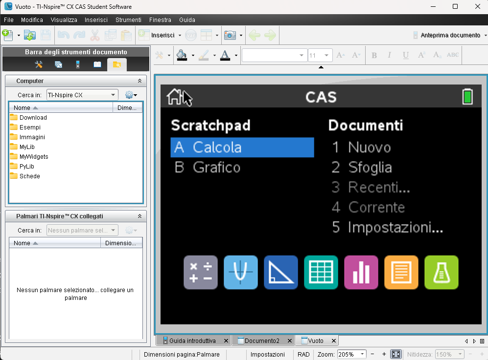
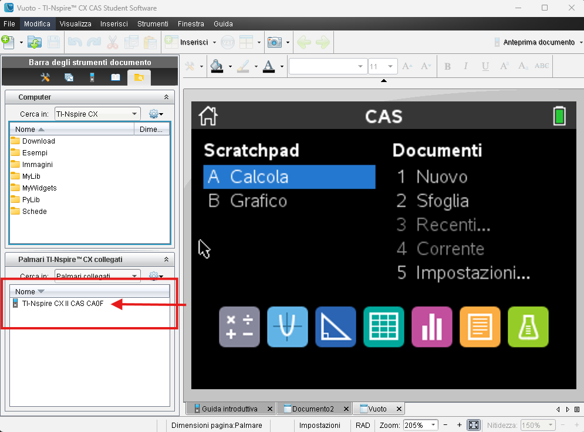
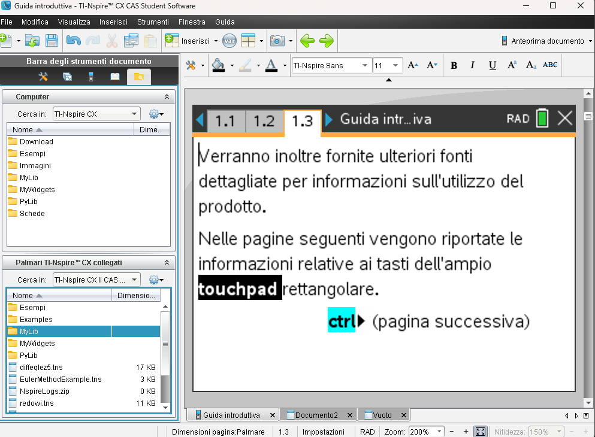
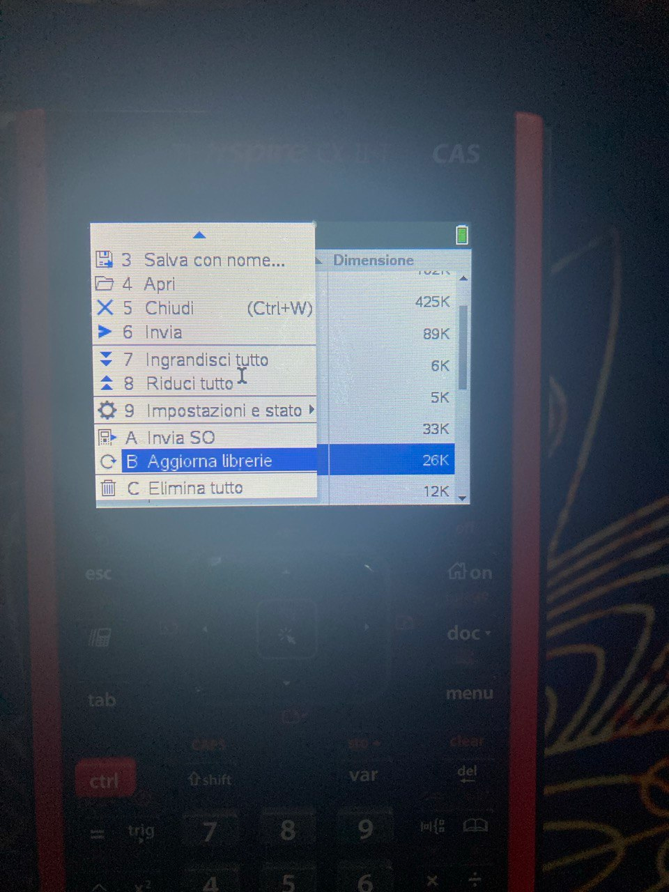
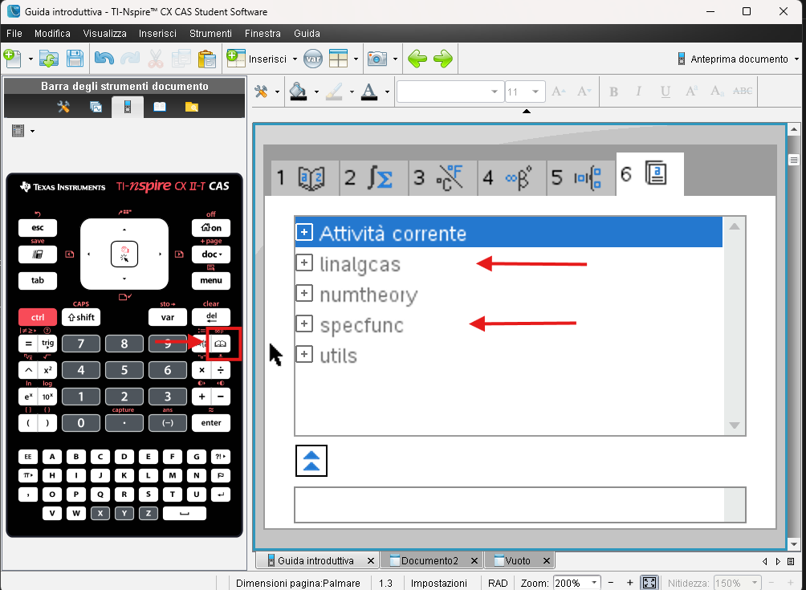
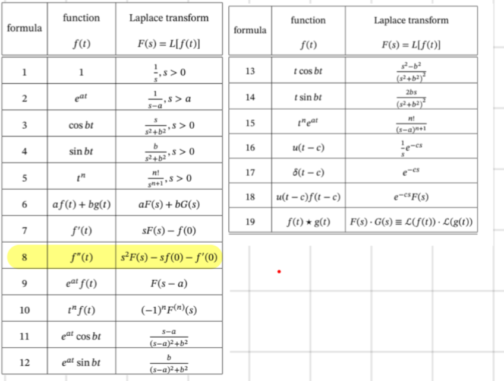

# ti-nispirecx-2t-library

## INSTALLATION LIBRARY GENERAL GUIDE: 

apri sw TINspireCXCASStudentSoftware 
[Link: ](TINspireCXCASStudentSoftware.exe)
vedrai una schermata di questo tipo: 

collega la calcolatrice al pc: 

clicca dove indicati dalla freccia

apri cartella MyLib e drag and drop librerie.

una volta fatto apri cartella my lib da calc clissa sulla libreria desiderata poi clicca il tasto Menu.

Seleziona aggiorna Librerie 

 una volta fatto la libreria sara installata e potrei vederne le funzioni qui: 

## LinalgCas Docs
### Part1: Linear Algebra

 

[this is the library](numtheory.tns)

 

    ceigenvals(Matrix)- symbolic complex eigenvalues of a matrix

    clearmat()- delete temporary matrices

    cofactor(Matrix,i,j) - cofactor of a matrix

    comatrix(Matrix) - comatrix of a matrix (matrix of cofactors)

    diagonalization(Matrix)- matrix diagonalization

    dn(Matrix)- Jordan–Chevalley decomposition of a matrix M, where M=D+N, N·D=D·N

    eigenvals(Matrix)- symbolic real eigenvalues of a matrix

    eigenvects(Matrix,λ)- symbolic basis of the eigenspace of a matrix related to eigenvalue λ.

    expmat(Matrix)- symbolic matrix exponential, ^(t·Matrix).

    gausstep(Matrix)- step-by-step row matrix reduction.

    help()- displays syntax info for functions and programs from library linalgcas.

    inversestep(Matrix)- step-by-step matrix inverse computation.

    kernelbasis(Matrix)- basis of kernel (null space) of a square matrix

    kernelvectors(Matrix)- kernel (null space) vectors of a matrix

    pwrmat(Matrix)- symbolic matrix power, Matrix^(n)

    rank(Matrix)- rank of a matrix

    simultstep(aMatrix, bVector)- step-by-step version of simult().

 
### Part2: System of Linear Differential Equations

    desystem(A,B)- solve system of differential equations in the form X'(t)=A·X(t)+B(t)

    desysinitcond(A,B,t0,X0)- solve above system with initial condition X(t0)=x0. 

        A: constant n×n matrix representing a system of n linear differential equations.

        B: column-matrix, constant or with coefficients depending on t.

        t0: number

        X0: column-matrix 

    desysnewcond(t1,X1)- solve the previously solved system of linear differential equations again, but with new initial conditions X(t1)=X1

 --- 
  

## Laplace Docs

 

[this is the library](./laplace/specfunc.tns)

 

    laplace(f(t))

        nota: non posso mettere f' o y' ma solo funzioni sin cos etc
        quindi principalemnte fi a mano con la segueste tabella al posto di questa e poi realmente utile e antitrasformata!

    ilaplace(F(s)) 
        calcolo antitrasformata

